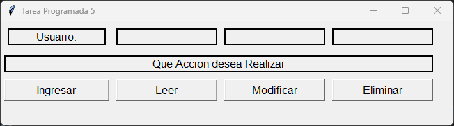

# ***_Tarea Programada # 1_***

* Lenguaje Utilizado
    * Python
* Objetivo de la Tarea: 
    * Investigar e implementar la libreria Tkinter
    * Programa que evalua 3 numeros enteros del 1 al 10, seleccionando el menor y mayor
    * Multiplicar el numero mayor y menor.
    * Numero mayor es a 5 multiplicarlo por 4, si es menor multiplicarlo por 3. Y el numero mayor debe ser elevedado a la potencia de 2
    * Numero menor o igual a 5 multiplicarlo por 2. Y el numero mayor debe ser elevedado a la potencia de 2
    * Todos los resultados deben ser mostrados en Pantalla
    * 
 
# ***_Tarea Programada # 2_***
  * Lenguaje Utilizado
    * Python
* Objetivo de la Tarea:
     * Realizar una calculadora basica con la libreria tkinter
     * Utilizacion de la funcion Lambda
     * 

# ***_Tarea Programada # 3_***
* Lenguaje Utilizado
    * Python
* Objetivo de la Tarea:
    * Desarrollar un programa en Python con una interfaz gráfica de usuario utilizando la librería Tkinter.
    * El programa tiene que permitir consultar y mostrar información específica de distintas tablas predefinidas.
    * El programa deberá permitir al usuario ingresar un número de consulta o un nombre, y desplegar la información correspondiente sobre la persona seleccionada.
    * 
      
# ***_Tarea Programada # 4_***
* Lenguaje Utilizado
    * Python
    * Base Datos SQL Server
* Objetivo de la Tarea:
    * Desarrollar un programa en Python con una interfaz gráfica de usuario utilizando la librería Tkinter.
    * El programa deberá conectarse a una base de datos SQL.
    * El programa deberá permitir al usuario iniciar sesión ingresando sus credenciales.
    * Una vez logueado, el programa mostrará los datos específicos del usuario logueado en la interfaz.
    * 
    * 

# ***_Tarea Programada # 5_***
* Lenguaje Utilizado
    * Python
    * Base Datos SQL Server
* Objetivo de la Tarea:
   * Utilizar la herencia y las clases para estructurar el código de manera eficiente y organizada.
   * Desarrollar un programa en Python con una interfaz gráfica de usuario utilizando la librería Tkinter, continuando con la funcionalidad de la Tarea #4.
   * Implementar las operaciones CRUD (Crear, Leer, Actualizar y Borrar) para la base de datos SQL.
   * El programa deberá permitir al usuario interactuar con la base de datos a través de la interfaz, aplicando las operaciones CRUD sobre los datos de los usuarios.
  * 
  * 
  * 
  * 
  * 
  * 
 
# ***_Tarea Programada # 6_***

* Lenguaje Utilizado
    * Python
    * Base Datos SQL Server
       * Nivel de Compatibilidad SQL Server 2016 (130)    

* Objetivo de la Tarea:

* Investigar e Implementar la Librería Tkinter:
  * Diseñar un programa gráfico utilizando Tkinter para crear un menú principal de cajeros automáticos.
  * Implementar ventanas gráficas que permitan la selección de cajeros y realizar diversas operaciones como depósitos, retiros y consulta de saldo.
  * Establecer estilos y elementos gráficos en las ventanas según el diseño requerido.

* Desarrollar Funcionalidad de Cajeros:
   * Crear un menú principal con botones e imágenes para seleccionar un cajero.
   * Implementar verificación del estado del cajero (libre, ocupado, en mantenimiento, fuera de servicio) y gestionar la selección de cajeros según su disponibilidad.
   * Desarrollar opciones de transacciones: depósito, retiro, consulta de saldo y cambio de cajero, con controles de validación para montos y límites.
   * Implementar la opción para volver al menú de cajeros desde las pantallas de transacción.

* Diseñar e Implementar Base de Datos:
   * Crear una base de datos para registrar movimientos de cajeros y usuarios, incluyendo tablas para usuarios, bancos, cuentas y auditoría.
   * Simular credenciales de usuarios para acceso al sistema.
   * Cargar datos iniciales en las tablas antes de la ejecución del programa.
   * Diseñar un diagrama entidad-relación para visualizar la estructura de la base de datos.

--------------------------------------------------------------------
* Institucion: 
    * Colegio Universitario de Cartago
* Profesor: 
    * Audie Ruiz Ortega
* TI-141 Programación III 
    * II Cuatrimestre, 2024
